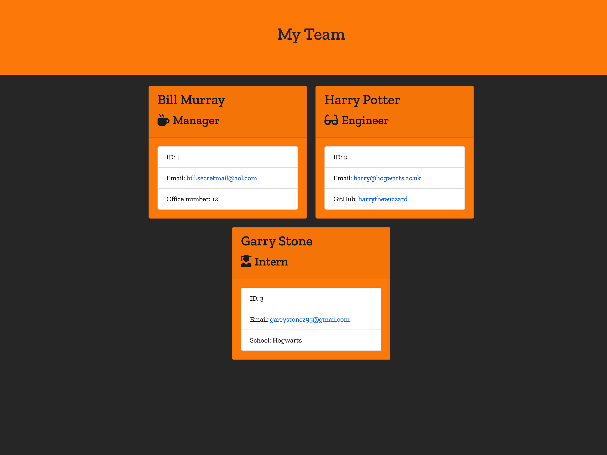

# Team Page Generator (HTML)

## Description
My motivation was to create an automated tool that can take user input to generate an HTML file showcasing a team's details.
I built this project so that I can quickly create a presentable HTML file with details about my team.
The app solves the problem of having to think about how to structure a HTML and style it.
I learned that node.js is a very powerful automation tool and that it's essential to run server-side applications.
What makes my project stand out is that it gives you a quick and presentable HTML page with minimal effort.

## Table of Contents
- [Installation](#installation)
- [Usage](#usage)
- [License](#license)
- [Contributing](#contributing)
- [Tests](#tests)
- [Questions](#questions)

## Installation
To install this project, open the terminal and simply run the command 'npm install' inside the folder of this repo, once all dependecies are installed run the command 'node index.js'.

## Usage
The project should be used any time you need to create a new page for your team.
The following image shows the web application's appearance and functionality:

## Tests
Jest testing library

## Contributors
Alex Grigore

## Questions
For questions about the project, you can reach me at [GitHub: agworkgit](https://github.com/agworkgit) or contact me via email at agworksbox@gmail.com.

## License
This project is licensed under the MIT License.

## Badges

